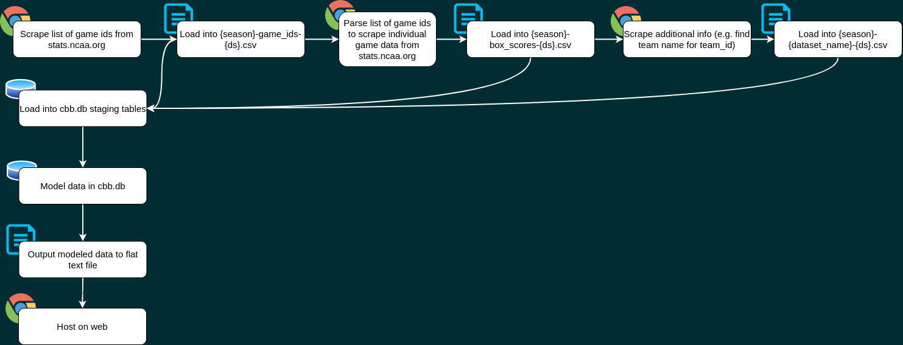

# college-basketball-data

## Flowchart 

## Roadmap

* Develop process to scrape:
  * ~~game_ids~~
  * ~~game_summaries~~
  * team_ids
* Develop process to load raw data to a database.
* Develop SQL transforms for:
  * dim_team
  * dim_game
  * fact_game_summary
* Develop process to load modelled data to .csv. 
* Develop process to scrape:
  * game_box_scores
* Develop modeled box score data

## Tasks

### `01-scrape_game_ids.py`
Parameters:
* **`season`**: The college basketball season (year). For a season e.g. 2019-2020, you would enter the year when the season ended (2020).

Takes a season (int) and scrapes a list of game_ids and creates a text file with a list of all game_ids at [`/raw_data/{season}_game-ids_{run_date}.txt`](/raw_data)

### `02-scrape_game_summaries.py`
Parameters:
* **`season`**: The college basketball season (year). For a season e.g. 2019-2020, you would enter the year when the season ended (2020).
* **`game_id`**: The unique game id used by the NCAA.

Takes a list of game_ids, loops through them to scrape each box score for summary details. Creates a text file with a list of all game_ids at [`/raw_data/{season}_game-summaries_{run_date}.txt`](/raw_data)

## Data Dictionary

### Raw Data

#### game-ids: 
List of game_ids for a season.

Fields:
* **`season`** **(integer)**: The college basketball season (year). For a season e.g. 2019-2020, you would enter the year when the season ended (2020).
* **`game_id`** **(integer)**: The unique game id used by the NCAA.

#### game-summaries: 
List of game_ids for a season.

Fields:
* **`game_id`** **(integer)**: The unique game id used by the NCAA.
* **`game_date`** **(timestamp)**: The date and time of tipoff. *Blank string ("") if error in parsing.*
* **`visit_id`** **(integer)**: The unique team id for the away team. 
* **`home_id`** **(integer)**: The unique team id for the home team.
* **`visit_scores`** **(list)**: List of scores by half for the away team. 
    * 1st score: first half score
    * 2nd score: second half score
    * Last score: final score
    * Other: If there are more than three scores, the remaining scores are each OT period. E.g. if there are 5 scores listed [20,15,5,7,47]. 1st half = 20 points, 2nd half = 15 points, 1st OT = 5 points, 2nd OT = 7 points, Total Points = 47.
* **`home_scores`** ***(list)**: List of scores by half for the home team. (Same structure as visit_scores above)
* **`attendance`** **(integer)***: Number of fans in attendance. *-1 if error in parsing.*
* **`officials`** **(list)**: Name of referees. *Blank list ([]) if error in parsing.*
